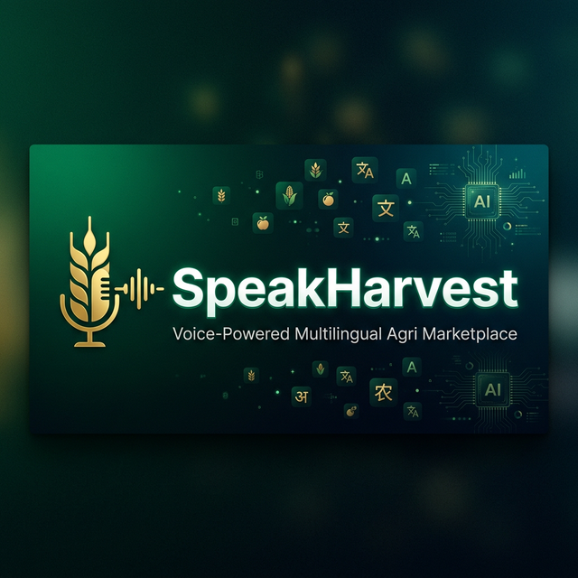
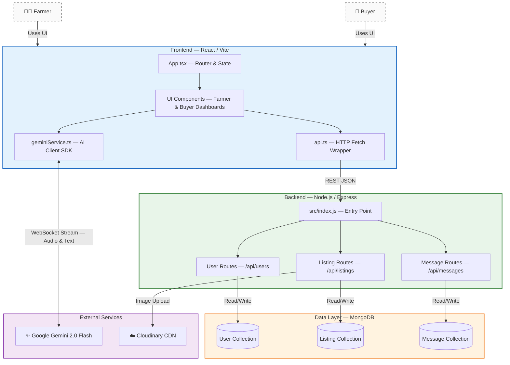

<p align="center">
  
</p>

<h1 align="center">🌾 SpeakHarvest — Voice-Powered Multilingual Agri Marketplace</h1>

<p align="center">
  <b>Bridging the communication gap between Indian farmers and buyers through AI-powered voice, real-time translation, and smart market insights.</b>
</p>

<p align="center">
  <a href="#-key-features"></a>
  <a href="#-tech-stack"></a>
  <a href="#-getting-started"></a>
  <a href="#-system-architecture"></a>
</p>

<p align="center">
  
  
  
  
  
  
  
</p>

---

## 🚀 The Problem

> **75% of Indian farmers** speak regional languages and lack digital literacy. Existing agri-marketplaces are text-heavy, English-first, and inaccessible — leaving millions unable to negotiate fair prices or access market intelligence.

**SpeakHarvest** solves this with a **voice-first, AI-native** platform where farmers and buyers can list, discover, negotiate, and trade crops — **entirely through voice**, in **6+ Indian languages**, with **zero typing required**.

---

## ✨ Key Features

### 🎙️ Intelligent Voice Assistant (Gemini Live)
The platform features a deeply integrated, real-time voice assistant powered by **Google Gemini 2.0 Flash** with **multilingual** support (English & Regional Languages):

<table>
<tr>
<td width="50%">

#### 🛒 For Buyers
- **Advanced Market Search** — Filter by location, price range, freshness, farmer name, or crop
  - *"Show me wheat available in Punjab"*
  - *"Crops under ₹50/kg"*
  - *"Show listings added today"*
- **Negotiation Aide** — AI reads message history & sends replies via voice
- **Smart Sorting** — Instant sort by price (Low ↔ High)

</td>
<td width="50%">

#### 🧑‍🌾 For Farmers
- **Hands-Free Inventory** — Create, update & delete listings by voice
  - *"Post 100kg of Potatoes at ₹25/kg in Nashik"*
  - *"Change the price of Onions to ₹30"*
- **Voice Inbox** — *"Do I have any new messages?"*
- **Instant Replies** — Dictate responses without typing
- **Market Insights** — AI-generated pricing & trend analysis

</td>
</tr>
</table>

### 🌐 Multilingual & Accessible
| Feature | Description |
|:--------|:------------|
| **Real-time Chat Translation** | Messages auto-translate between farmer & buyer preferred languages |
| **6 Language Support** | Hindi, English, Marathi, Telugu, Tamil, Bengali |
| **Audio-First Interface** | Full platform control through voice — zero typing needed |

### ✨ Premium UI/UX
| Feature | Description |
|:--------|:------------|
| 🌙 **Immersive Dark Mode** | Circular reveal animation, system preference detection, persistent settings |
| 🔮 **Glassmorphism** | Modern translucent UI elements with backdrop blur |
| ⚡ **Micro-interactions** | Hover lifts, glow effects, press-scale, ripple buttons, shine overlays |
| 🎨 **Dynamic Transitions** | Seamless color morphing across all themes |

### 🔒 Enterprise-Grade Security
| Layer | Implementation |
|:------|:--------------|
| **DDoS Protection** | `express-rate-limit` — brute-force & bot swarm prevention |
| **NoSQL Injection Defense** | `mongo-sanitize` — input scrubbing on all objects |
| **Header Armor** | `helmet` — XSS, clickjacking, MIME-sniffing protection |
| **Payload Limits** | 50KB JSON body caps — prevents memory-exhaustion DOS |

---

## 🛠 Tech Stack

```
┌─────────────────────────────────────────────────────────┐
│                    FRONTEND (Client)                     │
│  React 19 · TypeScript · Vite 6 · TailwindCSS · Lucide  │
│  Google GenAI SDK · WebSocket Streaming                  │
├─────────────────────────────────────────────────────────┤
│                     BACKEND (Server)                     │
│  Node.js · Express 5 · Mongoose 9 · Multer · Cloudinary │
│  Helmet · Rate-Limiter · Mongo-Sanitize                  │
├─────────────────────────────────────────────────────────┤
│                     DATA & AI LAYER                      │
│  MongoDB · Google Gemini 2.0 Flash · Cloudinary CDN      │
└─────────────────────────────────────────────────────────┘
```

---

## 📐 System Architecture



---

## 📁 Project Structure

```
XIBIT-2k26/
├── frontend/                   # React + TypeScript + Vite
│   ├── src/
│   │   ├── App.tsx             # Main controller — routing & state
│   │   ├── api.ts              # Centralized backend API calls
│   │   ├── types.ts            # TypeScript interfaces
│   │   ├── constants.ts        # Translations, mock data, configs
│   │   ├── index.css           # Global styles & design system
│   │   ├── components/
│   │   │   ├── LanguageSelector.tsx
│   │   │   ├── LanguageDropdown.tsx
│   │   │   ├── LiveAssistant.tsx    # Gemini voice UI
│   │   │   ├── ThemeToggle.tsx      # Dark mode toggle
│   │   │   └── NameCollectionModal.tsx
│   │   ├── pages/
│   │   │   ├── FarmerDashboard.tsx   # Full farmer experience
│   │   │   └── BuyerDashboard.tsx    # Full buyer experience
│   │   ├── services/
│   │   │   └── geminiService.ts     # Google GenAI integration
│   │   ├── context/                 # React context providers
│   │   └── utils/                   # Utility functions
│   ├── index.html
│   ├── vite.config.ts
│   └── tsconfig.json
│
├── backend/                    # Node.js + Express
│   ├── src/
│   │   ├── index.js            # Server entry — middleware & routes
│   │   ├── config/             # Database & service configs
│   │   ├── models/
│   │   │   ├── User.js
│   │   │   ├── Listing.js
│   │   │   └── Message.js
│   │   ├── routes/
│   │   │   ├── userRoutes.js
│   │   │   ├── listingRoutes.js
│   │   │   └── messageRoutes.js
│   │   ├── middlewares/        # Auth, rate-limit, sanitization
│   │   └── utils/              # Helper functions
│   └── package.json
│
├── DEPLOYMENT.md               # Deployment guide (Vercel + Render)
└── README.md                   # ← You are here
```

---

## ⚡ Getting Started

### Prerequisites

| Tool | Version |
|:-----|:--------|
| **Node.js** | v18+ recommended |
| **MongoDB** | Local or [Atlas](https://www.mongodb.com/atlas) |
| **Gemini API Key** | [Get one here](https://aistudio.google.com/apikey) |

### 1. Clone the Repository

```bash
git clone https://github.com/ANTHELIS/XIBIT-2k26.git
cd XIBIT-2k26
```

### 2. Backend Setup

```bash
cd backend
npm install
```

Create a `backend/.env` file:
```env
PORT=5000
MONGO_URI=your_mongodb_connection_string

CLOUDINARY_CLOUD_NAME=your_cloud_name
CLOUDINARY_API_KEY=your_api_key
CLOUDINARY_API_SECRET=your_api_secret
```

### 3. Frontend Setup

```bash
cd frontend
npm install
```

Create a `frontend/.env` file:
```env
GEMINI_API_KEY=your_gemini_api_key_here
```

### 4. Run the Application

Open **two terminals**:

```bash
# Terminal 1 — Backend
cd backend
npm run dev          # → http://localhost:5000
```

```bash
# Terminal 2 — Frontend
cd frontend
npm run dev          # → http://localhost:5173
```

> **🎉 That's it!** Open `http://localhost:5173` in your browser and start speaking!

---

## 🌍 Deployment

The app is designed for seamless cloud deployment:

| Service | Platform | Root Directory |
|:--------|:---------|:---------------|
| **Backend** | [Render](https://render.com) | `backend/` |
| **Frontend** | [Vercel](https://vercel.com) | `frontend/` |

> See the full deployment guide in [`DEPLOYMENT.md`](./DEPLOYMENT.md).

---

## 🔌 API Reference

### User Routes — `/api/users`
| Method | Endpoint | Description |
|:-------|:---------|:------------|
| `POST` | `/api/users/login` | Login or auto-register a user |
| `PUT` | `/api/users/:id` | Update user profile |

### Listing Routes — `/api/listings`
| Method | Endpoint | Description |
|:-------|:---------|:------------|
| `GET` | `/api/listings` | Fetch all crop listings |
| `POST` | `/api/listings` | Create a new listing |
| `PUT` | `/api/listings/:id` | Update an existing listing |
| `DELETE` | `/api/listings/:id` | Delete a listing |

### Message Routes — `/api/messages`
| Method | Endpoint | Description |
|:-------|:---------|:------------|
| `GET` | `/api/messages/:userId` | Get messages for a user |
| `POST` | `/api/messages` | Send a new message |

---

## 🤝 Contributing

We welcome contributions! Here's how to get started:

1. **Fork** the repository
2. **Create** a feature branch (`git checkout -b feat/amazing-feature`)
3. **Commit** your changes (`git commit -m 'Add amazing feature'`)
4. **Push** to the branch (`git push origin feat/amazing-feature`)
5. **Open** a Pull Request

---

## 👥 Team

<table>
<tr>
  <td align="center">
    <a href="https://github.com/ANTHELIS">
      
      <br/>
      <sub><b>@ANTHELIS</b></sub>
    </a>
    <br/>
    <sub>Full-Stack • AI Integration • Architecture</sub>
  </td>
  <td align="center">
    <a href="https://github.com/urmipaul007">
      
      <br/>
      <sub><b>@urmipaul007</b></sub>
    </a>
    <br/>
    <sub>Frontend Enhancements • UI Polish</sub>
  </td>
  <td align="center">
    <a href="https://github.com/pritamroman07-droid">
      
      <br/>
      <sub><b>@pritamroman07-droid</b></sub>
    </a>
    <br/>
    <sub>Contributor</sub>
  </td>
  <td align="center">
    <a href="https://github.com/bidisha861-dev">
      
      <br/>
      <sub><b>@bidisha861-dev</b></sub>
    </a>
    <br/>
    <sub>Contributor</sub>
  </td>
</tr>
</table>

---

## 📜 License

This project is licensed under the **ISC License**.

---

<p align="center">
  <sub>Built with ❤️ for Indian farmers and buyers • Powered by Google Gemini AI</sub>
</p>
<p align="center">
  
</p>
